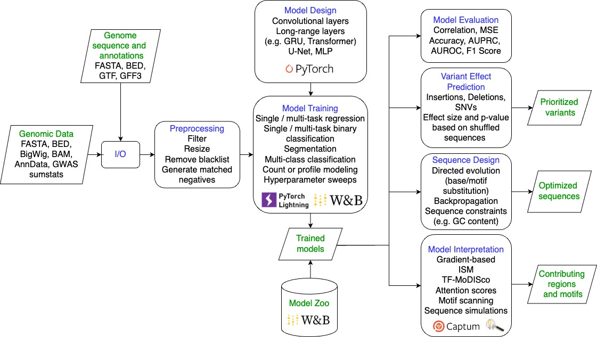

[](https://doi.org/10.5281/zenodo.15627611)

# varseq

varseq is a Python library to train, interpret, and apply deep learning models to DNA sequences. Code documentation is available [here](https://genentech.github.io/varseq/).



## Breaking Changes in v1.1.0

**Model Zoo Migration:** The varseq model zoo has moved from Weights & Biases to [HuggingFace](https://huggingface.co/collections/Genentech/varseq-model-zoo). The `varseq.resources` API has changed:

```python
# Old API (wandb) - still available at varseq.resources.wandb but will be removed in future
varseq.resources.load_model(project="human-atac-catlas", model_name="model")

# New API (HuggingFace)
varseq.resources.load_model(repo_id="Genentech/human-atac-catlas-model", filename="model.ckpt")
```

Browse the zoo at https://huggingface.co/collections/Genentech/varseq-model-zoo and see the [Model Zoo Tutorial](docs/tutorials/6_model_zoo.ipynb) for updated usage.

## Installation

To install from source:

```shell
git clone https://github.com/Genentech/varseq.git
cd varseq
pip install .
```

To install using pip:

```shell
pip install varseq
```
Typical installation time including all dependencies is under 10 minutes.

To train or use transformer models containing flash attention layers, [flash-attn](https://github.com/Dao-AILab/flash-attention) needs to be installed first:
```shell
conda install -c conda-forge cudatoolkit-dev -y
pip install torch ninja
pip install flash-attn --no-build-isolation
pip install varseq
```

## Contributing

See our [contribution guide](https://genentech.github.io/varseq/contributing.html).

## Additional requirements

If you want to use genome annotation features through the function `varseq.io.genome.read_gtf`, you will need to install the following UCSC utilities: `genePredToBed`, `genePredToGtf`, `bedToGenePred`, `gtfToGenePred`, `gff3ToGenePred`.

If you want to create bigWig files through the function `varseq.data.preprocess.make_insertion_bigwig`, you will need to install the following UCSC utilities: `bedGraphToBigWig`.

UCSC utilities can be installed from `http://hgdownload.cse.ucsc.edu/admin/exe/`, for example using the following commands:

```shell
rsync -aP rsync://hgdownload.soe.ucsc.edu/genome/admin/exe/linux.x86_64/bedGraphToBigWig /usr/bin/
rsync -aP rsync://hgdownload.soe.ucsc.edu/genome/admin/exe/linux.x86_64/genePredToBed /usr/bin/
rsync -aP rsync://hgdownload.soe.ucsc.edu/genome/admin/exe/linux.x86_64/genePredToGtf /usr/bin/
rsync -aP rsync://hgdownload.soe.ucsc.edu/genome/admin/exe/linux.x86_64/bedToGenePred /usr/bin/
rsync -aP rsync://hgdownload.soe.ucsc.edu/genome/admin/exe/linux.x86_64/gtfToGenePred /usr/bin/
rsync -aP rsync://hgdownload.soe.ucsc.edu/genome/admin/exe/linux.x86_64/gff3ToGenePred /usr/bin/
```

or via bioconda:

```shell
conda install -y \
bioconda::ucsc-bedgraphtobigwig \
bioconda::ucsc-genepredtobed    \
bioconda::ucsc-genepredtogtf    \
bioconda::ucsc-bedtogenepred    \
bioconda::ucsc-gtftogenepred    \
bioconda::ucsc-gff3togenepred
```

If you want to create ATAC-seq coverage bigWig files using `varseq.data.preprocess.make_insertion_bigwig`, you will need to install bedtools. See https://bedtools.readthedocs.io/en/latest/content/installation.html for instructions.

## Citation

Please cite our paper: https://www.nature.com/articles/s41592-025-02868-z

Lal, A., Gunsalus, L., Nair, S. et al. varseq: a comprehensive framework for DNA sequence modeling and design. Nat Methods (2025). https://doi.org/10.1038/s41592-025-02868-z
